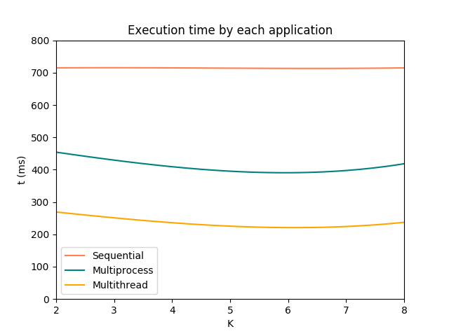

## Report for test 1

_Student: Isadora Sophia Garcia Rodopoulos_

_RA: 158018_

### Intro
The assignment consisted in applying a toy operation, which:

* receives an input ```N``` as argument;
* allocates an array ```v``` of 64-bit integers of size N * 2²°
* for each position i of the array ```v```:
     + assigns a random number between 0 and 1000
* calculates average value of ```v```

Basically, given an input ```N``` - which is the size of our array, we receive an output of the average value of all the numbers within our array.

### Implementation
The implementation consisted of three differente approaches:
1. Sequential application;
1. Multithread application;
1. Multiprocess application.

For the multithread application, it was used the _OpenMP_ library. As for the multiprocess application, it was used standard Linux methods.

### Results
The results collected were estimated from executions with ```N = 64```. The graph bellow speaks for itself.



Clearly, the multithread operation achieved the best speedup - this is mainly due to the overhead involved in the multiprocess operation. In general, Linux handles threads with less overhead than processes - the inter-thread communication for sharing data is much simpler and there is no need for context switches. As in this case we don't have any restrictions in which of them to use, a multithreading would be the best solution for speeding up our current application.

Another interesting note is that we actually achieve a speed down after 8 threads, which is reasonable considering the execution took place in a Quad-Core CPU.
