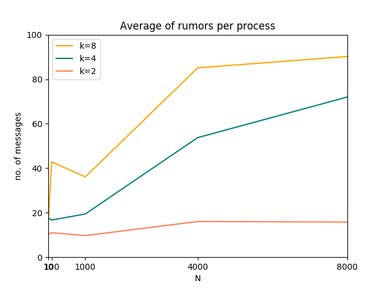

## Report for test 2

_Student: Isadora Sophia Garcia Rodopoulos_

_RA: 158018_

### Intro
The assignment consisted in the simulation of the gossip protocol, by relying on TCP/IP sockets. 

```
python [-O] gossip.py N K
```

In summary, the algorithm applied was:

* ```N``` and ```k``` are received as arguments;
* dispatch a total of ```N``` processes, each with its own port;
* send a single message as a *rumor* for the first process;
* for each process:
     + a _listener_ is created and awaits for a rumor
     + when a rumor is received for the first time, start a _sender_: which spread the rumor randomly accross all processes available (different ports and hosts)
     + if _listener_ receives another rumor, it sends a *STOP* message back.
     + otherwise, if it received a *STOP* message, stops sending new messages with a probability of ```1/k```
        + if ```p < 1/k```, interrupt _sender_, send a signal and continue to listen for new messages
* when all processes have received the rumor, stop the application and gather data 
* otherwise, force quit the processes (or apply a timeout)

### Implementation
The implementation relied on the _ZeroMQ_ library in _Python_ - mainly due to the complexity of the packets and to allow shorter feedbacks, even though it was initially implemented in _C_.

Each *process* is dispatched as a thread, using the ```threading``` library from _Python_ - i.e. a _listener_ and a _sender_ are two different threads, related to a same abstract process, bound to a certain port.

Also, note that some ```sleep()``` functions were applied in order to ensure priority to some processes that have not received any message yet. The _listener_ threads also had priority over the _sender_ threads.

### Results
The results turned out to be highly experimental. For instance, in order to allow its execution on my OS (Ubuntu 16.04), some flags configuration were necessary, such as:

```bash
$ ulimit -n
$ ulimit -s
$ cat /etc/security/limits.conf
$ sysctl -n fs.nr_open
```

These commands allowed to increase the limit of the total sockets supported by the OS and the stack size per application, which were necessary when N > 1000.

#### How many times did each process tried to gossip?


The graph above shows that the attempt to gossip scaled according with ```N``` and ```k```. With higher ```k```, it took longer to a _sender_ be killed and, because of that, a process would try to gossip more. With a higher ```N```, there would be more possibilities to spread a rumor before betting itself killed, justifying a high gossip attempt number.

The results may vary because most of the simulations relied on the priority system applied to the threaads of _senders_ and _listeners_, which would vary according to the OS status and how well-spread the gossip was.

#### What was the rate of successful gossip attempts?


The failure rate was calculated by the total of packets that *were received and validated as an already seem rumor*. The rate was lower with higher a ```N``` and ```k``` because most of the packets were lost (and never received by any _listener_) due to the memory stack for each TCP socket: fewer packets were received and a chance of identifying an already seem rumor was lower.
     
#### In the end of the dissemination, how many processes have the rumor?


According to the graph, the percentage of simpler simulations was much more successful. Although a higher ```k``` would, in theory, allow an increase of the spread, in practice there were so much processes running by ```N``` that many packets were lost, and most of _sender_ threads completely dominate the execution process.
    
#### How long did it take betwewen the start and the end of the dissemination?

When a process took longer than one minute to receive any message it was simply assumed that the simulation was finished and the process did not receive any rumor. For that matter, _time_ was not taken into account when comparing results, but rather how many messages received the rumor.

In a more general matter, when ```N``` was bigger it did not imply in a quicker simulation, since the overhead for multiple processes was too high. It required a tradeoff between ```N``` and ```k``` - in general, when ```k=1``` it resulted in a faster simulation for high values of ```N```.

### Extra
By deploying two _Azure_ virtual machines, it was possible to execute a simulation between two hosts.

| | Total sent | Average gossips | Processes w/ a rumor | Failure rate |  Time  |
| --- | --- | --- | --- | --- | --- |
|**A**| 1024 | 10.24 | 100% | 37% | 3.96s |
|**B**| 727 | 7.27 | 100% | 53% | 2.47s |

Since the application was already built to support multiple hosts, it was only necessary to start it in both clients. Only one of the machines (**A** or **B**) would begin spreading the rumor until the simulation was finished.

The results reflect the numbers for ```N=100``` for each machine (totalizing 200 processes) and ```K=2```. Each of the numbers presented refers to the machine, i.e. there were 1024 rumors sent from machine **A** and 727 from machine **B**.

The performance improved in the sense that the simulation scaled much better, since there was the double number of cores that the processes could be parallelized.
